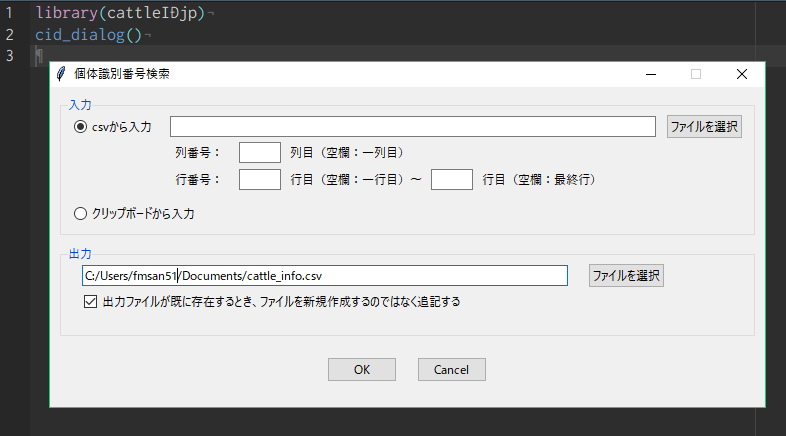

<!-- README.md is generated from README.Rmd. Please edit that file -->

# cattleIDjp

Searches and downloads cattle information from [the database of National
Livestock Breeding Center, Japan](https://www.id.nlbc.go.jp/) by cattle
identification numbers and outputs a csv file contains cattle
information. Search speed is about 10-12
cattles/min.

Rを用いて、家畜改良センターの[牛の個体識別情報検索サービス](https://www.id.nlbc.go.jp/)を利用するためのパッケージです。
検索速度は10-12頭/分です（サーバーに負担をかけないようわざと遅めにしています）。夜に実行して朝に結果を確認するといった感じの使い方をおすすめします。
出力はcsvまたはdata.frameです。途中で何かエラーが起きて強制終了になっても、そこまでの検索結果を出力します。

## cid\_xxx

`cid_dialog`:  
**The best choice.** It opens dialog to choose an input file and an
output file and set options. (See Example)  
  
**オススメ。**入力ファイルや出力ファイルを設定するためのダイアログを表示します。（Example参照）  

`cid_csv`, `cid_vector`, `cid_clipboard`: These use input of
csv/vector/clipboard.  
  
それぞれcsv/vector/クリップボードから個体識別番号を読み取って検索します。  
`cid_clipboard`はExcelのここからここまでの番号をぱぱっと検索したい、みたいなときに便利です。

cid means Cattle ID.  
ちなみにcidは Cattle ID の略です。

## Example

``` r
library(cattleIDjp)

# Opens dialog
cid_dialog()
```



``` r
id <- c(1083079037, 0123456789, 0396006198, 1389725782)
cid_vector(input = id, output = NULL)
#> 終了予想時刻（目安）： 2018-05-29 10:50:15 
#> 
#>  検索が終了しました
#> Warning: 
#>  以下の個体の情報が得られませんでした： 
#>  0123456789
#>    個体識別番号 出生の年月日   雌雄の別 母牛の個体識別番号           種別
#> 1    1083079037   2002.01.02 去勢（雄）               <NA>       黒毛和種
#> 2    1083079037   2002.01.02 去勢（雄）               <NA>       黒毛和種
#> 3    1083079037   2002.01.02 去勢（雄）               <NA>       黒毛和種
#> 4    1083079037   2002.01.02 去勢（雄）               <NA>       黒毛和種
#> 5    1083079037   2002.01.02 去勢（雄）               <NA>       黒毛和種
#> 6     396006198   2008.01.20 去勢（雄）          288803171 ホルスタイン種
#> 7     396006198   2008.01.20 去勢（雄）          288803171 ホルスタイン種
#> 8     396006198   2008.01.20 去勢（雄）          288803171 ホルスタイン種
#> 9     396006198   2008.01.20 去勢（雄）          288803171 ホルスタイン種
#> 10    396006198   2008.01.20 去勢（雄）          288803171 ホルスタイン種
#> 11    396006198   2008.01.20 去勢（雄）          288803171 ホルスタイン種
#> 12    396006198   2008.01.20 去勢（雄）          288803171 ホルスタイン種
#> 13    396006198   2008.01.20 去勢（雄）          288803171 ホルスタイン種
#> 14   1389725782   2015.03.01       メス         1381820713       黒毛和種
#> 15   1389725782   2015.03.01       メス         1381820713       黒毛和種
#> 16   1389725782   2015.03.01       メス         1381820713       黒毛和種
#> 17   1389725782   2015.03.01       メス         1381820713       黒毛和種
#> 18   1389725782   2015.03.01       メス         1381820713       黒毛和種
#> 19   1389725782   2015.03.01       メス         1381820713       黒毛和種
#> 20   0123456789        ERROR      ERROR              ERROR          ERROR
#>    異動内容 異動年月日 都道府県         市町村
#> 1      装着 2002.02.25 鹿児島県               
#> 2      転入 2002.10.27 鹿児島県       南九州市
#> 3      転出 2004.04.26 鹿児島県       南九州市
#> 4      搬入 2004.04.26 鹿児島県       南九州市
#> 5      と畜 2004.04.27 鹿児島県       南九州市
#> 6      出生 2008.01.20   北海道   上川郡清水町
#> 7      転出 2008.01.28   北海道   上川郡清水町
#> 8      転入 2008.01.28   北海道   上川郡清水町
#> 9      転出 2008.08.10   北海道   上川郡清水町
#> 10     転入 2008.08.10   北海道   二海郡八雲町
#> 11     転出 2009.10.07   北海道   二海郡八雲町
#> 12     搬入 2009.10.07   北海道         帯広市
#> 13     と畜 2009.10.08   北海道         帯広市
#> 14     出生 2015.03.01   北海道   河東郡音更町
#> 15     転出 2015.10.28   北海道   河東郡音更町
#> 16     転入 2015.10.29   青森県   上北郡七戸町
#> 17     転出 2016.08.31   青森県   上北郡七戸町
#> 18     搬入 2016.08.31   宮城県 仙台市宮城野区
#> 19     と畜 2016.09.01   宮城県 仙台市宮城野区
#> 20    ERROR      ERROR    ERROR          ERROR
#>                                    氏名または名称
#> 1                                                
#> 2                                      深野　剛史
#> 3                                      深野　剛史
#> 4                （株）ＪＡ食肉かごしま　南薩工場
#> 5                （株）ＪＡ食肉かごしま　南薩工場
#> 6                                      上野　清志
#> 7                                      上野　清志
#> 8                                      浅水　清志
#> 9                                      浅水　清志
#> 10                                       佐藤　睦
#> 11                                       佐藤　睦
#> 12     （株）北海道畜産公社　道東事業所　十勝工場
#> 13     （株）北海道畜産公社　道東事業所　十勝工場
#> 14   （独）家畜改良センター十勝牧場肉用牛第一基地
#> 15   （独）家畜改良センター十勝牧場肉用牛第一基地
#> 16 （独）家畜改良センター奥羽牧場現場後代検定施設
#> 17 （独）家畜改良センター奥羽牧場現場後代検定施設
#> 18                           仙台市ミートプラント
#> 19                           仙台市ミートプラント
#> 20                                          ERROR
```

## Notes

NLBC itself offers a paid service to extact its data. See
<https://www.id.nlbc.go.jp/pdf/katsuyou_kankei.pdf>.

家畜改良センター自体も有料で個体識別情報の提供サービスを行っています。
